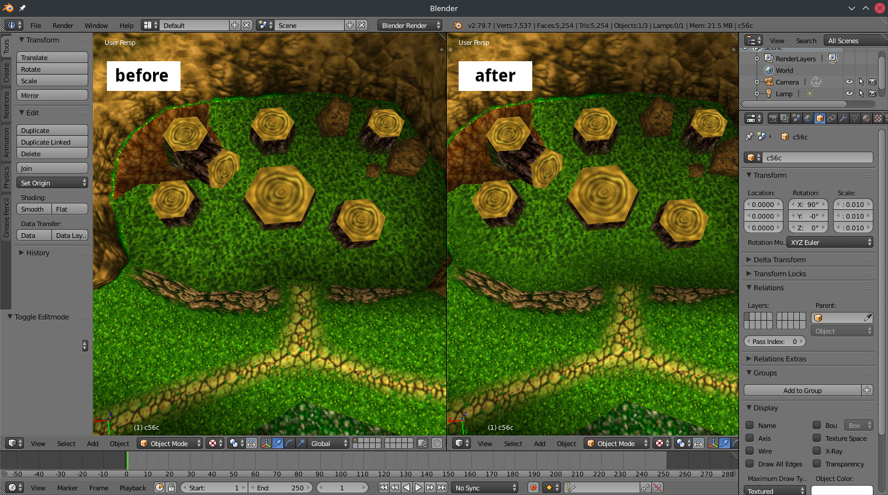

# mtlsort

```c
/* 
 * mtlsort <z64.me>
 *
 * modifies Wavefront OBJ and MTL files in such a way that
 * the materials declared in the MTL using 'newmtl' commands
 * are guaranteed to match the order of the corresponding
 * 'usemtl' commands in the OBJ; this is achieved by way of
 * duplicating materials in the desired order
 *
 * this is the messiest code I've written in a while, but
 * don't worry: valgrind reports no errors
 *
 */
```

## Why does this program exist?

Some programs (such as Blender) smartly group and display triangles in the order materials are defined.
While this optimization is handy and efficient for most use cases, it reduces accuracy in game exports
that rely on a specific draw order.

For that reason, this program was created to "unoptimize" material lists so that Blender will draw
the triangles in the same order they appear in the OBJ file. This is an optional step in the RareExports
pipeline, but there are cases where it helps.



## Valgrind output, just for fun

```
==47286== Memcheck, a memory error detector
==47286== Copyright (C) 2002-2017, and GNU GPL'd, by Julian Seward et al.
==47286== Using Valgrind-3.17.0 and LibVEX; rerun with -h for copyright info
==47286== Command: ./test c56c.obj c56c.mtl
==47286== 
==47286== 
==47286== HEAP SUMMARY:
==47286==     in use at exit: 0 bytes in 0 blocks
==47286==   total heap usage: 11 allocs, 11 frees, 632,856 bytes allocated
==47286== 
==47286== All heap blocks were freed -- no leaks are possible
==47286== 
==47286== For lists of detected and suppressed errors, rerun with: -s
==47286== ERROR SUMMARY: 0 errors from 0 contexts (suppressed: 0 from 0)
```
